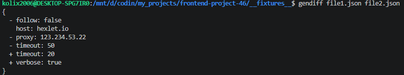
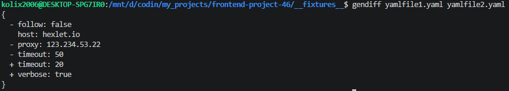
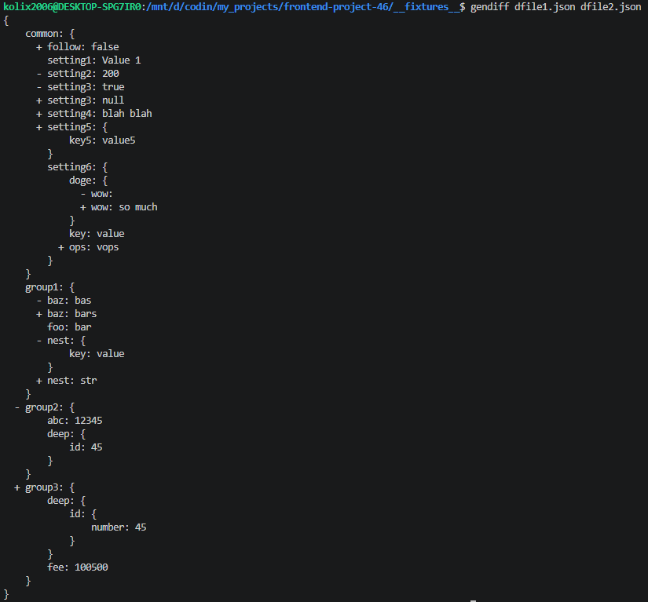
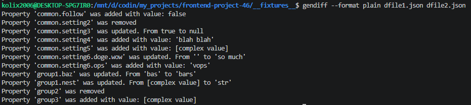
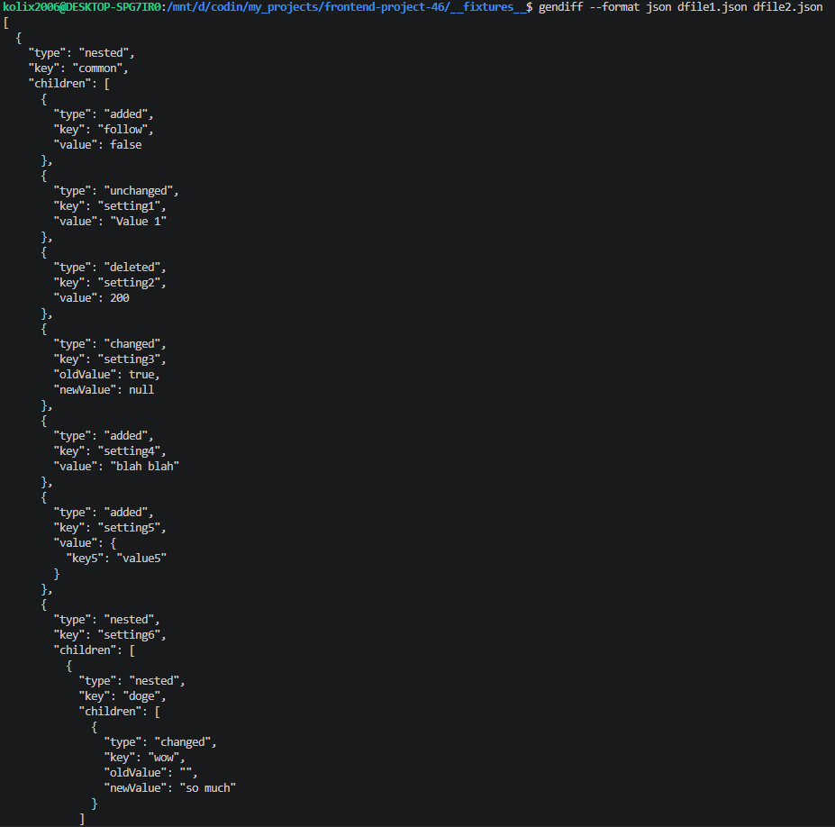

### Hexlet tests and linter status:
[](https://github.com/kolix2006/frontend-project-46/actions)
[](https://sonarcloud.io/summary/new_code?id=kolix2006_frontend-project-46)
[](https://sonarcloud.io/summary/new_code?id=kolix2006_frontend-project-46)
[](https://sonarcloud.io/summary/new_code?id=kolix2006_frontend-project-46)
[](https://sonarcloud.io/summary/new_code?id=kolix2006_frontend-project-46)
[](https://sonarcloud.io/summary/new_code?id=kolix2006_frontend-project-46)

## Вычислитель отличий

Вычисляет отличия между двумя файлами конфигурации.

Доступные расширения: `.json`, `.yml`/`.yaml`

Доступные форматы: `stylish` (по умолчанию), `plain`, `json`

## Установка

```bash
git clone https://github.com/kolix2006/frontend-project-46.git
cd frontend-project-46
npm ci
```

## Запуск

```bash
node gendiff.js file1.json file2.json                  # stylish по умолчанию
node gendiff.js --format plain file1.json file2.json   # plain-формат
node gendiff.js --format json file1.json file2.json    # json-формат
```

## Демонстрация

Плоские файлы:




Файлы с рекурсией в stylish-форматировании:



Файлы с рекурсией в plain-форматировании:



Файлы с рекурсией в json-форматировании:


